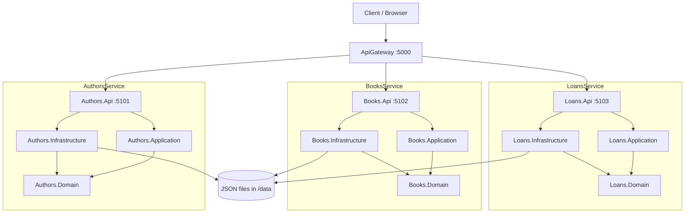

# LibraryMicroservices

A .NET microservices solution for a library domain, built with **Clean Architecture**, **JSON file persistence**, and a **YARP API Gateway**.

## Services

| Service | Base URL | Port | Responsibility |
|---------|----------|------|----------------|
| **ApiGateway** | `http://localhost:5000` | 5000 | Single entry point (reverse proxy) |
| **Authors.Api** | `http://localhost:5101` | 5101 | Manage authors |
| **Books.Api** | `http://localhost:5102` | 5102 | Manage books (linked to authors by `authorId`) |
| **Loans.Api** | `http://localhost:5103` | 5103 | Manage book loans and returns |

Each backend service follows the same layered structure:

```
Service/
├── Domain/          # Entities and repository interfaces
├── Application/     # Use cases, DTOs, validation
├── Infrastructure/  # JSON file repositories
└── Api/             # ASP.NET Core Web API
```

Shared JSON persistence logic lives in `Shared.BuildingBlocks`.

---

## API Endpoints

Use **`http://localhost:5000`** when running through the gateway, or the **direct service URL** when calling a service on its own.

### Gateway-only endpoints

These exist only on the API Gateway (`http://localhost:5000`).

| Method | Gateway URL | Description |
|--------|-------------|-------------|
| `GET` | `/health` | Gateway health check |
| `GET` | `/health/services` | Aggregated health of Authors, Books, and Loans |
| `GET` | `/authors/health` | Proxied health check for Authors service |
| `GET` | `/books/health` | Proxied health check for Books service |
| `GET` | `/loans/health` | Proxied health check for Loans service |

**Examples**

```powershell
curl http://localhost:5000/health
curl http://localhost:5000/health/services
curl http://localhost:5000/authors/health
```

---

### Authors API

| Method | Path | Gateway URL | Direct URL |
|--------|------|-------------|------------|
| `GET` | `/api/authors` | `http://localhost:5000/api/authors` | `http://localhost:5101/api/authors` |
| `GET` | `/api/authors/{id}` | `http://localhost:5000/api/authors/{id}` | `http://localhost:5101/api/authors/{id}` |
| `POST` | `/api/authors` | `http://localhost:5000/api/authors` | `http://localhost:5101/api/authors` |
| `PUT` | `/api/authors/{id}` | `http://localhost:5000/api/authors/{id}` | `http://localhost:5101/api/authors/{id}` |
| `DELETE` | `/api/authors/{id}` | `http://localhost:5000/api/authors/{id}` | `http://localhost:5101/api/authors/{id}` |
| `GET` | `/health` | — | `http://localhost:5101/health` |

**Request bodies**

Create author (`POST`):

```json
{
  "name": "New Author",
  "bio": "Optional biography"
}
```

Update author (`PUT`):

```json
{
  "name": "Updated Name",
  "bio": "Updated bio"
}
```

**Response example** (`GET /api/authors/a1`):

```json
{
  "id": "a1",
  "name": "Jane Austen",
  "bio": "English novelist known for social commentary and romance."
}
```

**Examples**

```powershell
# Via gateway
curl http://localhost:5000/api/authors
curl http://localhost:5000/api/authors/a1
curl -X POST http://localhost:5000/api/authors -H "Content-Type: application/json" -d "{\"name\":\"New Author\",\"bio\":\"Sample bio\"}"
curl -X PUT http://localhost:5000/api/authors/a1 -H "Content-Type: application/json" -d "{\"name\":\"Jane Austen\",\"bio\":\"Updated bio\"}"
curl -X DELETE http://localhost:5000/api/authors/a1

# Direct to Authors.Api
curl http://localhost:5101/api/authors
curl http://localhost:5101/api/authors/a1
curl http://localhost:5101/health
```

---

### Books API

| Method | Path | Gateway URL | Direct URL |
|--------|------|-------------|------------|
| `GET` | `/api/books` | `http://localhost:5000/api/books` | `http://localhost:5102/api/books` |
| `GET` | `/api/books/{id}` | `http://localhost:5000/api/books/{id}` | `http://localhost:5102/api/books/{id}` |
| `POST` | `/api/books` | `http://localhost:5000/api/books` | `http://localhost:5102/api/books` |
| `PUT` | `/api/books/{id}` | `http://localhost:5000/api/books/{id}` | `http://localhost:5102/api/books/{id}` |
| `DELETE` | `/api/books/{id}` | `http://localhost:5000/api/books/{id}` | `http://localhost:5102/api/books/{id}` |
| `GET` | `/health` | — | `http://localhost:5102/health` |

**Request bodies**

Create book (`POST`):

```json
{
  "title": "New Book",
  "authorId": "a1",
  "isbn": "978-0000000000",
  "publishedYear": 2026
}
```

Update book (`PUT`):

```json
{
  "title": "Updated Title",
  "authorId": "a1",
  "isbn": "978-0000000000",
  "publishedYear": 2026
}
```

**Response example** (`GET /api/books/b1`):

```json
{
  "id": "b1",
  "title": "Pride and Prejudice",
  "authorId": "a1",
  "isbn": "978-0141439518",
  "publishedYear": 1813
}
```

**Examples**

```powershell
# Via gateway
curl http://localhost:5000/api/books
curl http://localhost:5000/api/books/b1
curl -X POST http://localhost:5000/api/books -H "Content-Type: application/json" -d "{\"title\":\"New Book\",\"authorId\":\"a1\",\"isbn\":\"978-0000000000\",\"publishedYear\":2026}"
curl -X PUT http://localhost:5000/api/books/b1 -H "Content-Type: application/json" -d "{\"title\":\"Pride and Prejudice\",\"authorId\":\"a1\",\"isbn\":\"978-0141439518\",\"publishedYear\":1813}"
curl -X DELETE http://localhost:5000/api/books/b1

# Direct to Books.Api
curl http://localhost:5102/api/books
curl http://localhost:5102/api/books/b1
curl http://localhost:5102/health
```

---

### Loans API

| Method | Path | Gateway URL | Direct URL |
|--------|------|-------------|------------|
| `GET` | `/api/loans` | `http://localhost:5000/api/loans` | `http://localhost:5103/api/loans` |
| `GET` | `/api/loans/{id}` | `http://localhost:5000/api/loans/{id}` | `http://localhost:5103/api/loans/{id}` |
| `POST` | `/api/loans` | `http://localhost:5000/api/loans` | `http://localhost:5103/api/loans` |
| `POST` | `/api/loans/{id}/return` | `http://localhost:5000/api/loans/{id}/return` | `http://localhost:5103/api/loans/{id}/return` |
| `DELETE` | `/api/loans/{id}` | `http://localhost:5000/api/loans/{id}` | `http://localhost:5103/api/loans/{id}` |
| `GET` | `/health` | — | `http://localhost:5103/health` |

**Request bodies**

Create loan (`POST`):

```json
{
  "bookId": "b3",
  "borrowerName": "Alice Smith",
  "loanDate": "2026-06-06"
}
```

Return loan (`POST /api/loans/{id}/return`):

```json
{
  "returnDate": "2026-06-10"
}
```

**Response example** (`GET /api/loans/l1`):

```json
{
  "id": "l1",
  "bookId": "b1",
  "borrowerName": "Alice Smith",
  "loanDate": "2026-05-01",
  "returnDate": null
}
```

**Examples**

```powershell
# Via gateway
curl http://localhost:5000/api/loans
curl http://localhost:5000/api/loans/l1
curl -X POST http://localhost:5000/api/loans -H "Content-Type: application/json" -d "{\"bookId\":\"b3\",\"borrowerName\":\"Alice\",\"loanDate\":\"2026-06-06\"}"
curl -X POST http://localhost:5000/api/loans/l1/return -H "Content-Type: application/json" -d "{\"returnDate\":\"2026-06-10\"}"
curl -X DELETE http://localhost:5000/api/loans/l1

# Direct to Loans.Api
curl http://localhost:5103/api/loans
curl http://localhost:5103/api/loans/l1
curl http://localhost:5103/health
```

---

### HTTP status codes

| Code | Meaning |
|------|---------|
| `200 OK` | Successful GET, PUT, or return loan |
| `201 Created` | Resource created (POST) |
| `204 No Content` | Successful DELETE |
| `400 Bad Request` | Validation error |
| `404 Not Found` | Resource not found |
| `409 Conflict` | Loan already returned |
| `502 Bad Gateway` | Gateway cannot reach a backend service (service not running) |

---

## Seed data

Seed data is stored under `data/`:

| File | Sample IDs |
|------|------------|
| `authors.json` | `a1`, `a2`, `a3` |
| `books.json` | `b1`, `b2`, `b3` |
| `loans.json` | `l1`, `l2` |

Each API reads/writes its own JSON file. Override the path in `appsettings.json`:

```json
{
  "Authors": { "DataFilePath": "data/authors.json" }
}
```

---

## Prerequisites

- [.NET 10 SDK](https://dotnet.microsoft.com/download) (or newer; `global.json` rolls forward)

---

## Build and test

```powershell
cd C:\Users\BalajiTelugunti\Projects\LibraryMicroservices
dotnet restore
dotnet build
dotnet test
```

**Tip:** Stop all running APIs before rebuilding (**Shift+F5** in Visual Studio, or run `.\scripts\stop-all.ps1`).

---

## Run services

### Option A: Visual Studio (recommended)

1. Select **"All Services + Gateway"** from the startup profile dropdown (or configure multiple startup projects).
2. Press **F5**.
3. Call APIs via `http://localhost:5000`.

### Option B: PowerShell script

```powershell
.\scripts\start-all.ps1
```

Stop all services:

```powershell
.\scripts\stop-all.ps1
```

### Option C: Individual terminals

```powershell
dotnet run --project src/Authors/Authors.Api
dotnet run --project src/Books/Books.Api
dotnet run --project src/Loans/Loans.Api
dotnet run --project src/ApiGateway/ApiGateway
```

---

## Deploy to IIS

Each API project includes `appsettings.Production.json` with paths relative to the shared data folder (`..\data\*.json`). The publish script builds all four apps and prepares the folder layout for IIS.

### Prerequisites

- .NET 10 SDK (build machine)
- [ASP.NET Core Hosting Bundle](https://dotnet.microsoft.com/download/dotnet/10.0) on the IIS server
- IIS with the ASP.NET Core Module

### Publish

```powershell
# Default output: C:\inetpub\library
.\scripts\publish-iis.ps1

# Custom path
.\scripts\publish-iis.ps1 -PublishRoot "D:\sites\library"

# Create IIS app pools and sites automatically (run as Administrator)
.\scripts\publish-iis.ps1 -InstallIisSites
```

The script:

- Publishes **authors**, **books**, **loans**, and **gateway** to separate folders
- Copies seed JSON into a shared **`data`** folder (preserves existing files unless `-OverwriteSeedData` is used)
- Sets `ASPNETCORE_ENVIRONMENT=Production` in each `web.config`
- Grants backend app pools Modify access on the data folder

### IIS layout

```
C:\inetpub\library\
  authors\    → port 5101
  books\      → port 5102
  loans\      → port 5103
  gateway\    → port 80
  data\       → authors.json, books.json, loans.json
```

Create four app pools (**No Managed Code**): `LibraryAuthorsPool`, `LibraryBooksPool`, `LibraryLoansPool`, `LibraryGatewayPool`. Point each site at the matching folder, or use `-InstallIisSites`.

After all sites are started:

```powershell
curl http://localhost/health
curl http://localhost/api/authors
```

Stdout logs are written to `<publish-folder>\logs\` when troubleshooting startup issues.

---

## Tests

- **Application tests** — service logic against isolated temp JSON files
- **API tests** — integration tests using `WebApplicationFactory`
- **Gateway tests** — gateway health and proxy configuration

Test projects copy seed JSON into the output directory so tests do not mutate shared data files.

---

## Architecture diagram


